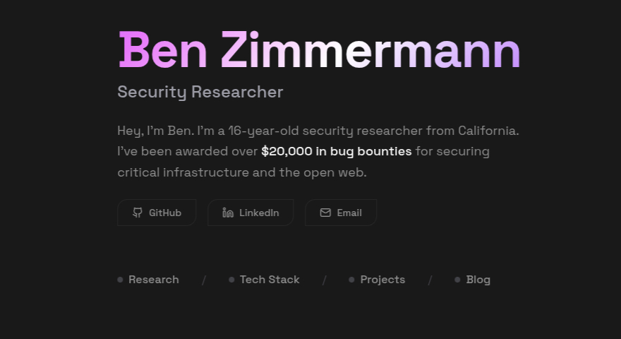

# bzzimmy.com

A modern portfolio website showcasing security research achievements and bug bounty work. Built with Next.js, React, and Tailwind CSS with custom animated components.



## Features

- **Security Research Showcase** - Displays vulnerability disclosures with bounty amounts and impact details
- **Tech Stack Section** - Highlights tools and languages used in security research
- **Projects Portfolio** - Open-source projects and custom security tools
- **Animated UI** - Custom components featuring blur-fade animations, gradient text, and particle background effects
- **Dark Theme** - Purple and pink accent colors with smooth animations
- **Responsive Design** - Optimized for all screen sizes

## Tech Stack

- Next.js 16
- React 19
- TypeScript
- Tailwind CSS 4
- Radix UI Components
- Motion (animations)
- React Hook Form + Zod (form validation)

## Getting Started

Install dependencies:

```bash
npm install
```

Run the development server:

```bash
npm run dev
```

Open [http://localhost:3000](http://localhost:3000) to view the site.

## Deployment

Deployed on [Vercel](https://vercel.com) at [bzzimmy.vercel.app](https://bzzimmy.vercel.app)
