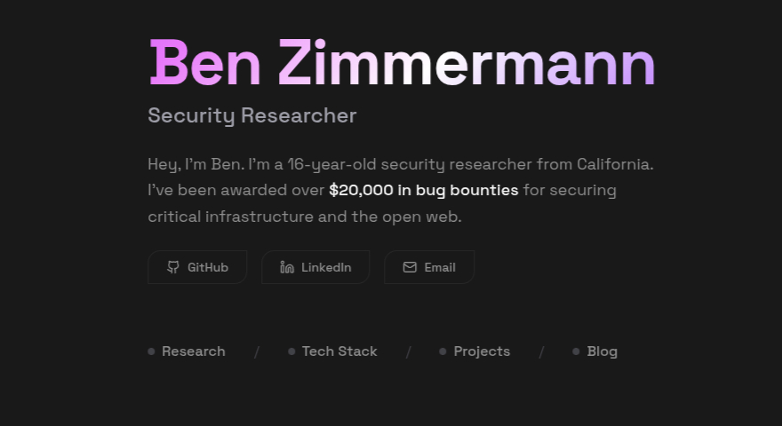

# bzzimmy.com

A portfolio website showcasing security research achievements and bug bounty work.



## Tech Stack


## Features

- Security research showcase with vulnerability disclosures
- Projects portfolio for open-source tools
- Animated UI with blur-fade and particle effects
- Dark theme with responsive design

## Getting Started

```bash
npm install
npm run dev
```

Open [http://localhost:3000](http://localhost:3000) to view the site.

## Deployment

Deployed on [Vercel](https://vercel.com) at [benzimmermann.dev](https://benzimmermann.dev)

## License

[MIT](LICENSE)
